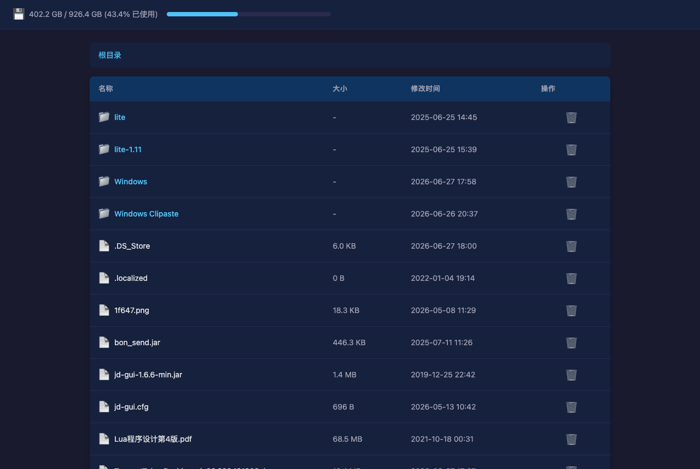
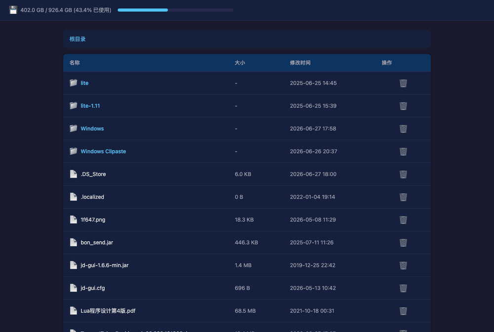

# Caddy File Manager

An HTTP handler plugin for [Caddy v2](https://caddyserver.com/) that provides a web-based file management interface for **browsing directories, viewing file info, and deleting files/directories**, along with disk usage of the underlying filesystem. The frontend is embedded directly into the binary via `go:embed`, so it works out of the box with no separate static-asset deployment.

> Module ID: `http.handlers.file_manager` ｜ Caddyfile directive: `file_manager`

---

## Screenshots

<!--
  Placeholder: replace the paths below with your actual screenshot / GIF.
  Recommended: put assets under docs/ (e.g. docs/screenshot.png, docs/demo.gif).
  Example capture: run the server, open http://localhost:8080, then record the
  browse → enter directory → delete-with-confirmation flow.
-->

| Main UI | Delete flow (demo) |
| ------- | ------------------ |
|  |  |

> The image links above are placeholders. Add `docs/screenshot.png` (a still of the file list + disk bar) and `docs/demo.gif` (a short recording of the browse/delete flow) to make them render.

---

## Features

- **Directory browsing**: lists the contents of the configured root, with directories first and files second, each sorted by name.
- **Breadcrumb navigation**: step into subdirectories; the frontend is a hash-based single-page app (no full reloads).
- **File metadata**: shows name, size (auto-formatted as B/KB/MB/GB/TB), and modification time.
- **Delete files / directories**: directories are removed recursively; deletion can optionally be protected by a password.
- **Disk usage**: displays total / used / free space and usage percentage of the filesystem containing the root (the progress bar turns red when usage > 90%).
- **Path traversal protection**: every path is normalized and validated to stay within the configured root (guards against `../` traversal, comparing after resolving symlinks).
- **Embedded frontend**: HTML / CSS / JS are compiled into the binary via `//go:embed frontend/*` for single-file distribution.
- **Chinese UI**: ships with a built-in Chinese interface and messages.

---

## Project Structure

```
caddy-file-manager/
├── module.go          # Module registration, config struct, Provision/Validate/ServeHTTP
├── caddyfile.go       # Caddyfile directive parsing (UnmarshalCaddyfile / parseCaddyfile)
├── handler.go         # HTTP routing and API handlers (list / delete / disk info / static)
├── fileservice.go     # File service: list, delete, safe path resolution
├── diskservice.go     # Disk service: disk usage via statfs (non-Windows)
├── fileservice_test.go
├── handler_test.go
├── frontend/          # Embedded frontend (go:embed)
│   ├── index.html
│   ├── style.css
│   └── app.js
├── cmd/caddy/         # Custom Caddy build entrypoint (registers standard modules + this plugin)
│   └── main.go
├── Caddyfile          # Example run configuration
├── go.mod / go.sum
└── README.md
```

---

## Configuration

### Caddyfile

`file_manager` is an HTTP handler directive supporting the following sub-directives:

| Sub-directive      | Description                                                  | Required |
| ------------------ | ----------------------------------------------------------- | -------- |
| `root`             | Filesystem path used as the file manager root (default `.`) | No       |
| `delete_password`  | Password required to delete; if empty, deletion needs none  | No       |

Example:

```caddyfile
{
    admin off
}

:8080 {
    route {
        file_manager {
            root /Users/you/Downloads
            delete_password your-secret
        }
    }
}
```

> Note: `file_manager` is an unordered handler directive, so it is recommended to place it inside a `route { ... }` block to make its execution order explicit.

### JSON Configuration

The equivalent native Caddy JSON snippet:

```json
{
  "handler": "file_manager",
  "root": "/Users/you/Downloads",
  "delete_password": "your-secret"
}
```

| Field             | Type     | Description                                  |
| ----------------- | -------- | -------------------------------------------- |
| `root`            | string   | Root directory path; defaults to `.`         |
| `delete_password` | string   | Delete password; empty means no password     |

---

## HTTP API

All API endpoints return a unified JSON envelope:

```json
{ "code": 0, "message": "ok", "data": {} }
```

- `code`: `0` means success; otherwise it equals the corresponding HTTP status code.
- `message`: result description (`ok` on success, or a localized message).
- `data`: business payload, may be `null`.

### 1. List files `GET /api/files`

| Parameter | Location | Description                              |
| --------- | -------- | ---------------------------------------- |
| `path`    | query    | Path relative to the root; defaults to `/` |

Response `data`:

```json
{
  "path": "/",
  "files": [
    { "name": "docs", "size": 224, "mod_time": "2026-06-27T17:30:12+08:00", "is_dir": true },
    { "name": "a.txt", "size": 18767, "mod_time": "2026-05-08T11:29:34+08:00", "is_dir": false }
  ]
}
```

> Sorting: directories first, then within each group sorted case-insensitively by name. `mod_time` is in RFC3339 (ISO 8601) format.

### 2. Delete file / directory `DELETE /api/files`

| Parameter / Header     | Location | Description                                      |
| ---------------------- | -------- | ------------------------------------------------ |
| `path`                 | query    | Relative path to delete; cannot be empty or `/`  |
| `X-Delete-Password`    | header   | Required when `delete_password` is configured    |

Behavior and responses:

- Directories are **removed recursively**.
- `path` empty or `/` → `400 cannot delete root directory`.
- Password configured but mismatched → `401 wrong password`.
- Deletion failure (e.g. permission denied) → `500 delete failed`.
- Success → `200 deleted successfully`.

### 3. Disk info `GET /api/disk`

Response `data`:

```json
{
  "total": 994662584320,
  "free": 562780262400,
  "used": 431882321920,
  "used_percent": 43.42,
  "password_required": false
}
```

- `total` / `free` / `used` in bytes, plus usage percentage `used_percent`.
- `password_required`: whether a delete password is configured; the frontend uses this to decide whether to show the password input.

### 4. Static assets

All requests other than the APIs above are served from the embedded `frontend/`; `/` returns `index.html`, and unmatched paths fall back to `index.html` (SPA fallback).

---

## Build

This repository is a Caddy plugin **module** and cannot run standalone — it must be compiled into Caddy. A build entrypoint is included at `cmd/caddy` (which registers the standard Caddy modules plus this plugin).

### Option 1: Build with the bundled entrypoint (recommended)

```bash
go mod tidy
go build -o ./build/caddy ./cmd/caddy
```

### Option 2: Use xcaddy

```bash
xcaddy build --with github.com/example/caddy-file-manager
```

### Notes for macOS (Apple Silicon)

On some macOS environments, binaries produced by Go's internal linker may exhibit the following two issues. Resolve them as shown below:

1. Runtime error `missing LC_UUID load command` — build with the external linker:

   ```bash
   go build -ldflags=-linkmode=external -o ./build/caddy ./cmd/caddy
   ```

2. The binary is killed immediately on launch (exit code 137 / SIGKILL) — it lacks a valid code signature; add an ad-hoc signature:

   ```bash
   codesign --force --sign - ./build/caddy
   ```

---

## Run

Use the bundled example `Caddyfile` (which sets `root` to a directory and listens on `:8080`):

```bash
./build/caddy run --config ./Caddyfile --adapter caddyfile
```

Then open [http://localhost:8080](http://localhost:8080) in your browser.

Validate the configuration:

```bash
./build/caddy validate --config ./Caddyfile --adapter caddyfile
```

Confirm the plugin is compiled into the binary:

```bash
./build/caddy list-modules | grep file_manager
# Output: http.handlers.file_manager
```

---

## Security Notes

- **Path traversal protection**: `ResolveSafePath` first normalizes the path with `filepath.Clean`, joins it to the root with `filepath.Join`, and—after resolving symlinks—verifies the result equals the root or is a child of it; otherwise it returns "path traversal denied".
- **Root protection**: deleting the root itself is forbidden (`path` empty, `/`, or resolving to the root).
- **Delete password**: configuring `delete_password` is strongly recommended for public or multi-user environments; otherwise anyone who can reach the page can delete files.
- This plugin grants **read and delete** access to the `root` directory according to configuration, so set `root` and the running process's filesystem permissions carefully.

---

## Platform Support

- Disk info (`/api/disk`) is implemented via `unix.Statfs` with the build constraint `//go:build !windows`, so **disk usage is only available on non-Windows platforms**. All other features (browsing / deleting / static assets) are cross-platform.

---

## Development & Testing

```bash
go test ./...
```

The repository includes `fileservice_test.go` and `handler_test.go` covering the file service and HTTP handling logic.

---

## License

This project is provided as an example. The module path is `github.com/example/caddy-file-manager`; replace it with your own module path and license declaration as needed.
